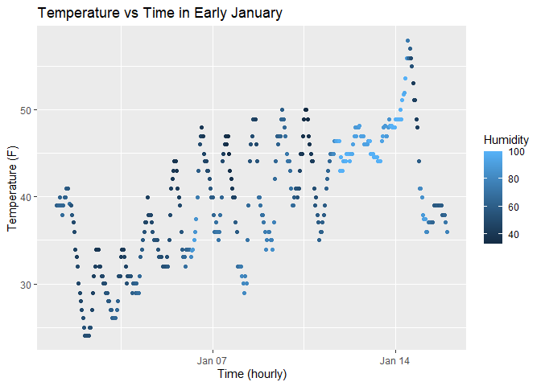

p8105_hw1_yx3033
================

## Problem 1

``` r
library(moderndive)
data("early_january_weather")
head(early_january_weather)
```

    ## # A tibble: 6 × 15
    ##   origin  year month   day  hour  temp  dewp humid wind_dir wind_speed wind_gust
    ##   <chr>  <int> <int> <int> <int> <dbl> <dbl> <dbl>    <dbl>      <dbl>     <dbl>
    ## 1 EWR     2013     1     1     1  39.0  26.1  59.4      270      10.4         NA
    ## 2 EWR     2013     1     1     2  39.0  27.0  61.6      250       8.06        NA
    ## 3 EWR     2013     1     1     3  39.0  28.0  64.4      240      11.5         NA
    ## 4 EWR     2013     1     1     4  39.9  28.0  62.2      250      12.7         NA
    ## 5 EWR     2013     1     1     5  39.0  28.0  64.4      260      12.7         NA
    ## 6 EWR     2013     1     1     6  37.9  28.0  67.2      240      11.5         NA
    ## # ℹ 4 more variables: precip <dbl>, pressure <dbl>, visib <dbl>,
    ## #   time_hour <dttm>

The variables include origin, year, month, day, hour, temp, dewp, humid,
wind_dir, wind_speed, wind_gust, precip, pressure, visib, time_hour.
This dataset has 358 rows and 15 columns. The mean temperature is
39.58F.

Important variables are:  
`time_hour`:the time of recording (hourly), it’s showing year-month-day
and time in EST e.g. “2013-01-01 01:00:00 EST”  
`temp`: temperature in F, ranges from 24.08 to 57.92  
`humid`: relative humidity, worte in percentage, 59.4 means 59.4%

``` r
library(ggplot2)
```

``` r
ggplot(early_january_weather, aes(x=time_hour, y=temp, color=humid))+
geom_point() + 
labs(
    title = "Temperature vs Time in Early January",
    x = "Time (hourly)",
    y = "Temperature (F)",
    color = "Humidity"
  )
```

<!-- -->

``` r
ggsave("scatterplot_temperature_vs_time.png")
```

    ## Saving 7 x 5 in image

The scatterplot shows how temperatures fluctuates during early days of
January. The temperatures range between mid-20s to mid-50s F. It shows a
cycle of waming the cooling throughout the day. Temperature shows an
general increasing trend from the beginning of January to mid-January.

## Problem 2

``` r
library(tidyverse)
```

    ## ── Attaching core tidyverse packages ──────────────────────── tidyverse 2.0.0 ──
    ## ✔ dplyr     1.1.4     ✔ readr     2.1.5
    ## ✔ forcats   1.0.0     ✔ stringr   1.5.1
    ## ✔ lubridate 1.9.4     ✔ tibble    3.3.0
    ## ✔ purrr     1.1.0     ✔ tidyr     1.3.1
    ## ── Conflicts ────────────────────────────────────────── tidyverse_conflicts() ──
    ## ✖ dplyr::filter() masks stats::filter()
    ## ✖ dplyr::lag()    masks stats::lag()
    ## ℹ Use the conflicted package (<http://conflicted.r-lib.org/>) to force all conflicts to become errors

``` r
df <- tibble(
  random_samp = rnorm(10),
  is_positive = random_samp>0,
  vec_char = c("a", "b", "c", "a","b", "c","a","b", "c","a"),
  fac_vec = factor(c("male","other","female","female","male","other","male","female","male","female"))
)
df
```

    ## # A tibble: 10 × 4
    ##    random_samp is_positive vec_char fac_vec
    ##          <dbl> <lgl>       <chr>    <fct>  
    ##  1    -0.969   FALSE       a        male   
    ##  2    -0.842   FALSE       b        other  
    ##  3     0.634   TRUE        c        female 
    ##  4    -0.317   FALSE       a        female 
    ##  5    -1.18    FALSE       b        male   
    ##  6    -0.342   FALSE       c        other  
    ##  7     2.51    TRUE        a        male   
    ##  8     1.36    TRUE        b        female 
    ##  9    -0.00930 FALSE       c        male   
    ## 10    -0.615   FALSE       a        female

``` r
mean(df |> pull(random_samp))  
```

    ## [1] 0.02234949

``` r
mean(df |> pull(is_positive))  
```

    ## [1] 0.3

``` r
mean(df |> pull(vec_char))  
```

    ## Warning in mean.default(pull(df, vec_char)): argument is not numeric or
    ## logical: returning NA

    ## [1] NA

``` r
mean(df |> pull(fac_vec)) 
```

    ## Warning in mean.default(pull(df, fac_vec)): argument is not numeric or logical:
    ## returning NA

    ## [1] NA

The mean function worked for numeric and logical vector but not for
character and factor vector.
